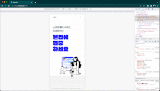

# WelKey

# Thumbnail

This is a website for WelKey company designed by SotaTek

---

### Desktop version


### Mobile version



---

### Folder Structure

<pre>
<b>/docs/</b> # Create for docs assets
<b>/src</b>
&emsp;<b>|__assets</b> # Folder to store the project's image, SVG icon
&emsp;<b>|__components</b> # Folder containing all the shared components of the project
&emsp;<b>|__screens</b> # The folder containing the project's main screens
&emsp;<b>|__themes</b> # Folder config colors, fonts, sizes
</pre>

## Prerequisites

### Tools to Download

**Note:** `.x` or `.x.x` indicates **the latest stable minor** version of that tool, e.g.: `1.x.x` > `1.62.3`

| Tool                                                                       | Version  | How to Check                                  | How To Get                                                                                               |
|----------------------------------------------------------------------------|----------|-----------------------------------------------|----------------------------------------------------------------------------------------------------------|
| [Node](https://nodejs.org/en)                                              | `20.x.x` | `node -v`                                     | `brew install node@16`                                                                                   |
| [Yarn](https://yarnpkg.com)                                                | `1.x.x`  | `yarn -v`                                     | `npm install --global yarn`                                                                              |
| [vite](https://vite.dev)                                                | `4.x.x`  | `npx vite -v`                                     | `npm install --g vite`                                                                              |

### How to Build this Project

1. clone repository
2. check out to `main` branch
3. Launch terminal and `cd` to the project
4. Run the following code.

    ```sh
    yarn install && yarn build && yarn dev
    ```
